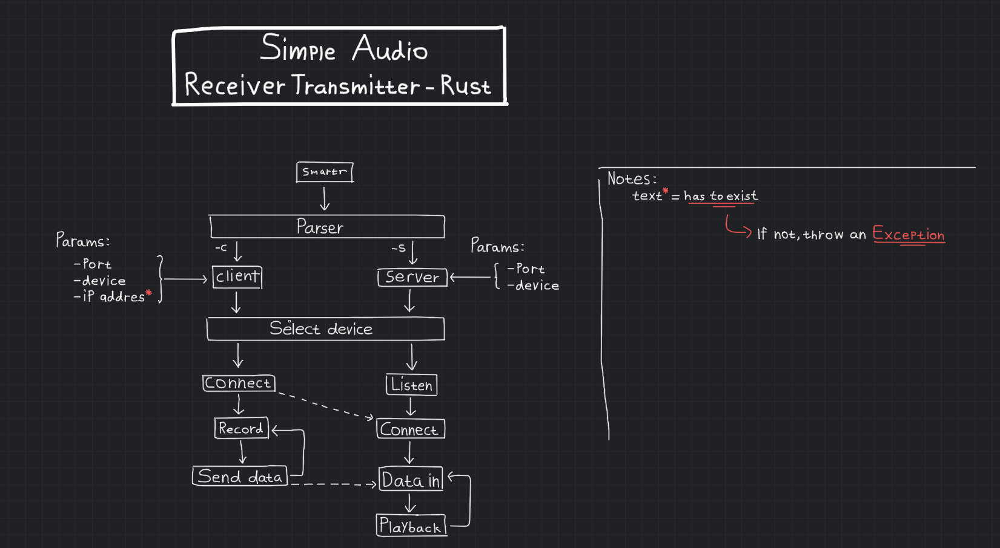

# SmART-R
this _Simple Audio Receiver Transmiter_ project was based on my previous python prototype SmART, while it was fun using SmART i can't help but to notice the delay, and so i created this.

hopefully by using rust, the amount of delay i get wont be as much as using python

### project graph

# Todo:
- [x] Smartr
- [x] Parser
    - [x] Client option
        - [x] Send to socket
        - [x] Record audio
        - [x] Transmit audio
    - [x] Server option
        - [x] Open a socket
        - [x] Receive audio
        - [x] playback audio
- [x] Select Device
